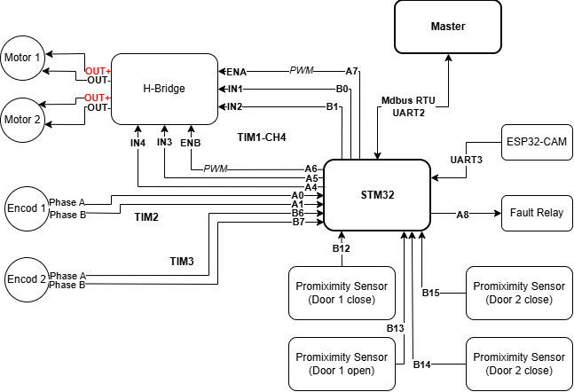

[](README.en.md) [](README.md)

## Door Controller – STM32F103C8T6 + FreeRTOS v2

This firmware controls a door mechanism using two JGB37‑520 geared DC motors with encoders. It uses PID control, integrates proximity sensors to determine door states, receives object‑detection information from an ESP32 via UART3, communicates with a master over Modbus RTU on UART2 (RS485), and manages status LEDs and a fault relay. The application is based on STM32 HAL and FreeRTOS (CMSIS‑RTOS v2).


### Table of Contents

- Project Overview
- Hardware Connections
- Software Architecture
- Setup Instructions
- Code Structure
- Usage
- Troubleshooting
- Assumptions and Notes
- References
- Appendix – Common Modbus Registers


## Project Overview

- Two JGB37‑520 DC geared motors with quadrature encoders to open/close the door; synchronized by PID.
- Four proximity sensors for end‑stops and safety/intermediate status.
- ESP32 on UART3 reports object detection only (no commands).
- Modbus RTU slave on UART2 (RS485) for all control/telemetry.
- Status LEDs: Fault, Modbus, Running; a fault relay for safety cut‑off.
- FreeRTOS tasks: MotorControlTask, Uart3RxTask, ModbusTask, StatusTask.
- Encoders via Timer Encoder mode; PWM on ENA/ENB to control speed/torque.


## Hardware Connections

Main connections between STM32F103C8T6 and peripherals.



### Motors and Encoders

| Part | Signal | MCU Pin | Notes |
|---|---|---|---|
| Motor 1 | ENA (PWM) | PA7 | TIM3_CH2 – PWM speed |
|  | IN1 (Dir) | PB1 | Direction GPIO |
|  | IN2 (Dir) | PB0 | Direction GPIO |
|  | Encoder A | PA0 | TIM2_CH1 – Encoder mode |
|  | Encoder B | PA1 | TIM2_CH2 – Encoder mode |
| Motor 2 | ENB (PWM) | PA6 | TIM3_CH1 – PWM speed |
|  | IN3 (Dir) | PA5 | Direction GPIO |
|  | IN4 (Dir) | PA4 | Direction GPIO |
|  | Encoder A | PB7 | TIM4_CH2 – Encoder mode |
|  | Encoder B | PB6 | TIM4_CH1 – Encoder mode |

### Proximity Sensors

| Sensor | MCU Pin | Role |
|---|---|---|
| PRM1 | PB15 | Right door open limit |
| PRM2 | PB14 | Right door close limit |
| PRM3 | PB13 | Left door open limit |
| PRM4 | PB12 | Left door close limit |

Note: Actual logic level and pull‑ups/pull‑downs depend on the sensors used. Software debouncing is recommended.

### UART and RS485

| Interface | Signal | MCU Pin | Notes |
|---|---|---|---|
| UART3 (ESP32) | TX3 | PB10 | Connects to ESP32 RX |
|  | RX3 | PB11 | Connects to ESP32 TX |
| UART2 (Modbus RTU) | TX2 | PA2 | RS485 Driver DI |
|  | RX2 | PA3 | RS485 Driver RO |
| RS485 Supply | VCC | 5V | Per RS485 module |
|  | GND | GND | Common ground |

The 4‑pin RS485 module (VCC, TX, RX, GND) supports auto‑direction; no DE/RE pin is required. Connect STM32 TX2 (PA2) → module RX, STM32 RX2 (PA3) ← module TX.

### LEDs and Relay

| Part | MCU Pin | Notes |
|---|---|---|
| Fault LED | PC15 | Error indication |
| Modbus LED | PC14 | Blinks on Modbus activity |
| Running LED | PC13 | System alive |
| Fault Relay | PA8 | Safety cut‑off on faults |


## Software Architecture

### FreeRTOS Tasks (suggested)

- MotorControlTask (high priority): 1–5 ms control loop; read encoders, compute PID, update PWM, check limits.
- Uart3RxTask (normal): parse ESP32 frames for object detection, post to queue.
- ModbusTask (normal): serve Modbus RTU requests (FC 0x03/0x06/0x10), map to registers.
- StatusTask (low): drive LEDs, fault monitoring, control fault relay.

### PID Control

- Goal: synchronize two motors to achieve target door position/speed.
- Feedback: speed/position from encoders.
- Constraints: PWM [0..100%], max speed, acceleration/deceleration.

PID gains are configurable via Modbus: `REG_PID_KP` / `REG_PID_KI` / `REG_PID_KD` (scaled ×1000).

### Encoders and Timers

- TIM2: Motor 1 encoder on PA0/PA1 (X4).
- TIM4: Motor 2 encoder on PB6/PB7 (X4).
|- TIM3: PWM outputs ENA (PA7 – CH2) and ENB (PA6 – CH1).

### UART and Modbus

- UART3: 115200 8N1 (default), ESP32 object‑detection reporting.
- UART2: Modbus RTU (Slave), 9600–115200 bps, 8E1/8N1 depending on system. With a 4‑pin RS485 module, direction is automatic (no DE/RE).
- Supported function codes: 0x03 (Read Holding), 0x06 (Write Single), 0x10 (Write Multiple).
- Full register map: see `Docs/modbus_registers_map.md`.

### Fault Handling

- Monitor `REG_FAULT_FLAGS`, `REG_ERROR_CODE`, end‑stops, and `REG_SAFETY_TIMEOUT`.
- Trigger the fault relay (PA8) on hazardous conditions (jam, limit exceeded, encoder loss, E‑Stop).
- Error reset via `REG_RESET_ERROR_CMD`; E‑Stop via `REG_EMERGENCY_STOP`.


## Setup Instructions

1. Install the latest STM32CubeIDE.
2. Create/Import project for STM32F103C8T6 (HSE 8 MHz, SYSCLK 72 MHz via PLL).
3. Clock: HSE → PLL ×9 → SYSCLK 72 MHz; APB1 36 MHz, APB2 72 MHz.
4. Enable FreeRTOS (CMSIS‑RTOS v2), select heap_4.c, tick = 1 kHz.
5. Configure GPIOs per tables above.
6. TIM2/TIM4 in Encoder mode; TIM3 in PWM (CH1/CH2).
7. UART3: 115200 8N1; UART2: Modbus settings as required (e.g., 115200 8N1 or 9600 8E1).
8. With 4‑pin RS485 (auto‑direction), no DE/RE pin configuration is needed.
9. Generate code, build, and flash with ST‑Link.


## Code Structure

- `Core/Src/main.c`: System init, `MX_*_Init()`, start scheduler.
- `Core/Src/freertos.c`: Create tasks, queues, timers; system lifecycle.
- `Core/Src/motor.c` – `Core/Inc/motor.h`: Motor control, PID, limits.
- `Core/Src/tim.c` – `Core/Inc/tim.h`: TIM2/TIM4 encoders, TIM3 PWM.
- `Core/Src/usart.c` – `Core/Inc/usart.h`: UART2/UART3 configuration.
- `Core/Inc/modbus_regs.h`: Modbus register definitions.
- `Core/Inc/modbus_rtu.h`: Modbus RTU slave API.
- `Docs/modbus_registers_map.md`: Detailed register map and examples.

Example PWM (brief):

```c
// Set duty 0..1000 -> 0..100%
__HAL_TIM_SET_COMPARE(&htim3, TIM_CHANNEL_1, duty); // ENB - PA6
__HAL_TIM_SET_COMPARE(&htim3, TIM_CHANNEL_2, duty); // ENA - PA7
```


## Usage

1. Power the system; verify RS485, ESP32, sensors, and motors are wired correctly.
2. On boot, Running LED (PC13) blinks; fault relay remains normal if no fault.
3. ESP32 (UART3) only reports object detection. STM32 updates `REG_OBJECT_DETECTION` (0x0004) and applies safety behavior (e.g., stop/disable close on obstacle). ESP32 does not issue door commands.
4. Modbus RTU (UART2) is the only channel to receive and execute commands:
   - Read door status: Holding Registers from 0x0000 (4 registers).
   - Set target position: write `REG_DOOR_TARGET_POSITION` (0x0002) with 0–100.
   - Configure PID: write multiple starting at 0x0015 (Kp/Ki/Kd, ×1000).
   - E‑Stop: write `REG_EMERGENCY_STOP` (0x002C) = 1.
5. Monitor Modbus LED (PC14) for traffic, Fault LED (PC15) on errors; fault relay (PA8) engages on critical faults.

See `Docs/modbus_registers_map.md` for concrete Modbus frames.


## Troubleshooting

- Motor not moving:
  - Check motor supply and EN/IN wiring.
  - Ensure TIM3 PWM runs and duty > 0.
  - Verify end‑stops (PRM1/PRM2) are not active.
- Door oscillates:
  - Reduce Kp or increase Ki/Kd; apply anti‑windup.
  - Ensure consistent control loop period (low RTOS jitter).
- Reverse direction:
  - Swap IN1/IN2 (IN3/IN4) logic or invert encoder feedback sign.
- Encoder counts wrong:
  - Check TIM2/TIM4 wiring; enable proper pulls.
  - Filter noise; verify timer max speed.
- No Modbus response:
  - Match baud/parity/stop bits.
  - If module is not auto‑direction, ensure DE/RE handling; for 4‑pin auto‑direction modules this is not required.
  - Check slave address (`REG_DEVICE_ID`) and RS485 A/B wiring.
- Corrupted UART3 data (ESP32):
  - Check 3.3V levels, baud rate, frame format.
  - Add checksum/CRC if your app protocol requires.


## Assumptions and Notes

- Defaults: UART3 115200 8N1; UART2 (Modbus) 115200 8N1 (configurable via `REG_CONFIG_*`).
- Initial PID gains: Kp=1.0, Ki=0.1, Kd=0.05 (write as 1000, 100, 50 with ×1000 scaling).
- Sensor debouncing: 5–20 ms software; optional RC hardware filtering.
- Limits should match mechanics: `REG_DOOR_OPEN_LIMIT`, `REG_DOOR_CLOSE_LIMIT`, `REG_*_ACCELERATION`, `REG_*_DECELERATION`.
- Safety timeout via `REG_SAFETY_TIMEOUT`.
- RS485 module: 4‑pin (VCC, TX, RX, GND) auto‑direction; verify voltage levels (3.3V/5V TTL).
- Full register map: `Docs/modbus_registers_map.md` and `Core/Inc/modbus_regs.h`.


## References

- STM32F103C8T6 Datasheet – `https://www.st.com/resource/en/datasheet/stm32f103c8.pdf`
- FreeRTOS (CMSIS‑RTOS v2) – `https://www.freertos.org/Documentation/RTOS_book.html`
- Modbus Application Protocol – `https://modbus.org/specs.php`
- STM32 HAL/LL TIM/UART – `https://www.st.com/en/embedded-software/stm32cube-mcu-packages.html`


## Appendix – Common Modbus Registers

| Address | Name | Description | Notes |
|---|---|---|---|
| 0x0000 | REG_DOOR_STATE | Door state | 0=Close,1=Opening,2=Open,3=Closing,4=Stopped,5=Error |
| 0x0002 | REG_DOOR_TARGET_POSITION | Target position (%) | 0–100 (R/W) |
| 0x0015 | REG_PID_KP | PID Kp (×1000) | e.g., 1500 = 1.5 |
| 0x0016 | REG_PID_KI | PID Ki (×1000) | e.g., 100 = 0.1 |
| 0x0017 | REG_PID_KD | PID Kd (×1000) | e.g., 50 = 0.05 |
| 0x0027 | REG_FAULT_FLAGS | Fault bitfield |  |
| 0x002C | REG_EMERGENCY_STOP | Emergency stop | Write 1 to E‑Stop |
| 0x0100 | REG_DEVICE_ID | Slave address | 1–247 |
| 0x0101 | REG_CONFIG_BAUDRATE | Baud config | 1=9600 … 5=115200 |


—

Copyright © 2025

